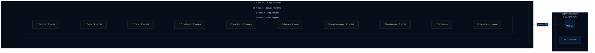

# Rendering Architecture

```mermaid
%%{init:{'theme':'base','themeVariables':{'background':'#060810','primaryColor':'#0c1a30','primaryTextColor':'#7dd3fc','primaryBorderColor':'#0e3a6e','edgeLabelBackground':'#0c1a30','lineColor':'#334155','secondaryColor':'#0f172a','clusterBkg':'#060c18','clusterBorder':'#1e3a5f','fontFamily':'JetBrains Mono','fontSize':'14'}}}%%
graph LR
  classDef ssr fill:#0d1a0d,stroke:#16a34a,color:#86efac
  classDef ctrl fill:#042f2e,stroke:#0d9488,color:#5eead4
  classDef csr fill:#2d1200,stroke:#c2410c,color:#fb923c
  classDef ssg fill:#1a0d1a,stroke:#7c3aed,color:#c4b5fd
  classDef isr fill:#1a1a0d,stroke:#ca8a04,color:#fde047
  classDef ppr fill:#0d1a2d,stroke:#2563eb,color:#93c5fd
  classDef unk fill:#1a1a1a,stroke:#6b7280,color:#9ca3af
  classDef pkg fill:#0c1018,stroke:#475569,color:#cbd5e1
  classDef ext fill:#2d1a06,stroke:#d97706,color:#fcd34d
  classDef muted fill:#0a0d14,stroke:#374151,color:#64748b,stroke-dasharray: 3 3
  classDef hdr fill:#06080f,stroke:#1e3a5f,color:#7dd3fc
  subgraph INFRA["☁ VERCEL · Edge Network"]
    subgraph RUNTIME["⚙ Node.js · Server Runtime"]
      subgraph FRAMEWORK["▲ Next.js · App Router"]
        subgraph REACT["⚛ React · SSR Engine"]
          T1_admin["📁 /admin · 1 route"]:::pkg
          T1_auth["📁 /auth · 4 routes"]:::pkg
          T1_cars["📁 /cars · 2 routes"]:::pkg
          T1_checkout["📁 /checkout · 2 routes"]:::pkg
          T1_contract["📁 /contract · 2 routes"]:::pkg
          T1_lease["📁 /lease · 1 route"]:::pkg
          T1_my_bookings["📁 /my-bookings · 2 routes"]:::pkg
          T1_my_leases["📁 /my-leases · 1 route"]:::pkg
          T1_root["📁 / · 1 route"]:::pkg
          T1_services["📁 /services · 1 route"]:::pkg
          T1_admin ~~~ T1_auth ~~~ T1_cars ~~~ T1_checkout ~~~ T1_contract ~~~ T1_lease ~~~ T1_my_bookings ~~~ T1_my_leases ~~~ T1_root ~~~ T1_services
        end
      end
    end
  end
  subgraph DATALAYER["🗄 DATA LAYER"]
    subgraph LARAVEL_G["⚡ Laravel API"]
      PG_SB[("MySQL")]
      SB_AUTH["JWT · Bearer"]
    end
  end
  INFRA -.->|"Laravel API"| PG_SB
```
